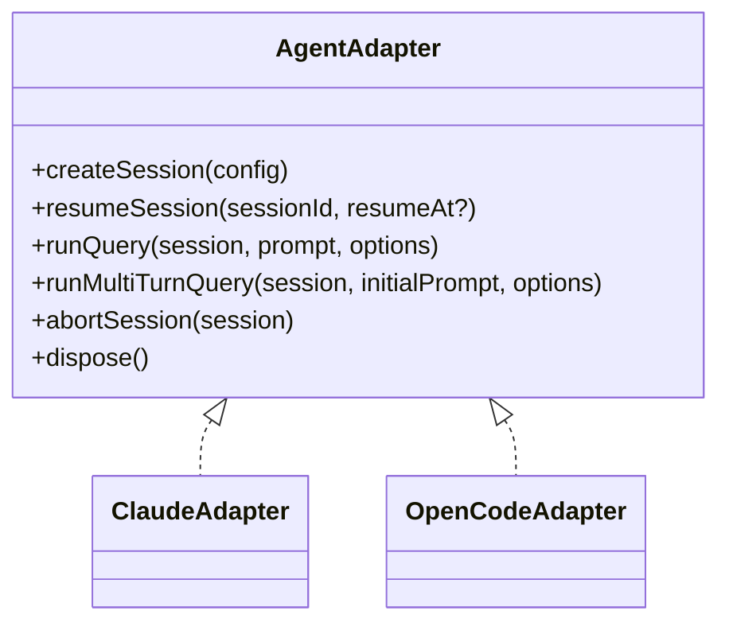

# OpenCode Integration Technical Guide

This document describes how NanoClaw integrates the OpenCode backend, how the SDK adapter layer works, and how to troubleshoot common failures.

## Architecture Overview

OpenCode support is implemented inside the containerized `agent-runner` and selected via `NANOCLAW_SDK_BACKEND=opencode`.

```mermaid
flowchart LR
  A[Host: src/index.ts + src/container-runner.ts] --> B[Container entrypoint.sh]
  B --> C{NANOCLAW_SDK_BACKEND}
  C -->|claude| D[Claude query loop]
  C -->|opencode| E[Generate /workspace/.opencode.json]
  E --> F[opencode serve 127.0.0.1:4096]
  F --> G[OpenCodeAdapter]
  G --> H[OpenCode event stream]
  G --> I[MCP server: ipc-mcp-stdio.js]
  I --> J[/workspace/ipc/tasks + messages]
  J --> A
```

Key files:
- `container/entrypoint.sh`
- `container/opencode.json.template`
- `container/agent-runner/src/index.ts`
- `container/agent-runner/src/sdk-adapter/index.ts`
- `container/agent-runner/src/sdk-adapter/opencode-adapter.ts`
- `container/agent-runner/src/ipc-mcp-stdio.ts`

## Adapter Pattern

NanoClaw normalizes backend differences through a shared adapter contract (`AgentAdapter`) in `container/agent-runner/src/sdk-adapter/types.ts`.



Factory selection:
- `getSdkBackend()` reads `NANOCLAW_SDK_BACKEND` (`claude` default).
- `createAdapter()` returns `ClaudeAdapter` or `OpenCodeAdapter`.

Runtime behavior:
- `runContainer()` in `container/agent-runner/src/index.ts` branches by backend.
- Claude path uses `query()` stream directly.
- OpenCode path creates/resumes an explicit session and runs `runMultiTurnQuery()`.

## Session Management Differences

Both backends persist session continuity, but lifecycle control is different.

| Area | Claude Backend | OpenCode Backend |
|---|---|---|
| Session creation | Implicit via first `query()` with streamed `system/init` | Explicit `client.session.create()` |
| Resume | `resume` + `resumeSessionAt` options on `query()` | `session.get()` and optional `session.fork(messageID)` |
| Turn completion | Stream naturally completes; loop re-enters for next IPC message | Explicit wait for `session.idle` event per turn |
| Session ID propagation | Taken from `system/init` | Managed in adapter (`activeSessionId`) and emitted in normalized `init` |
| Context injection | `systemPrompt.append` | `session.prompt({ noReply: true, ... })` for Global/Group context |

OpenCode-specific multi-turn loop (`runMultiTurnQuery`):
1. Send prompt to current session.
2. Stream and normalize events.
3. Emit result on terminal events (`session.idle`, `session.timeout`, `session.error`, `session.aborted`).
4. Drain IPC follow-up messages.
5. Repeat until `/workspace/ipc/input/_close` is consumed.

## MCP Tool Mapping

NanoClaw uses Claude-style tool identifiers in config, then maps them for OpenCode.

Mapping implementation:
- `mapAllowedToolsToOpenCode()` in `container/agent-runner/src/sdk-adapter/opencode-adapter.ts`
- Permission mapping helper: `generateOpenCodePermissionConfig()`

### Standard tool mapping

| NanoClaw tool | OpenCode tool |
|---|---|
| `Bash` | `bash` |
| `Read` | `read` |
| `Write` | `write` |
| `Edit` | `edit` |
| `Glob` | `glob` |
| `Grep` | `grep` |
| `WebSearch` | `websearch` |
| `WebFetch` | `webfetch` |
| `TodoWrite` | `todo` |
| `Skill` | `skill` |
| `NotebookEdit` | `notebook` |
| `Task` / `TaskOutput` / `TaskStop` | `task` |

No direct OpenCode equivalent (handled at flow/MCP level):
- `TeamCreate`
- `TeamDelete`
- `SendMessage`
- `ToolSearch`

### MCP wildcard and explicit mapping

| Claude-style allowlist entry | OpenCode representation |
|---|---|
| `mcp__*` | `allowAllMcp=true` |
| `mcp__nanoclaw__*` | `nanoclaw_*: true` |
| `mcp__nanoclaw__send_message` | `nanoclaw_send_message: true` |

Server configuration is declared in `container/opencode.json.template`:
- Local MCP server `nanoclaw`
- command: `node /tmp/dist/ipc-mcp-stdio.js`
- env passthrough: `NANOCLAW_CHAT_JID`, `NANOCLAW_GROUP_FOLDER`, `NANOCLAW_IS_MAIN`

## Agent Configuration

OpenCode reads a generated config file at `/workspace/.opencode.json`.

Generation flow:
1. `config-generator.ts` reads `/app/opencode.json.template`.
2. Replaces `${ENV_VAR}` placeholders.
3. Writes JSON to `/workspace/.opencode.json`.

Default config highlights:
- `dataDir: /home/node/.claude` (persistent session/state store)
- Built-in tools enabled (`bash`, `read`, `write`, etc.)
- MCP tools wildcard enabled for NanoClaw (`nanoclaw_*`)
- Agent registry:
  - `nanoclaw` (primary)
  - `explore` (subagent)
  - `general` (subagent)
- `default.agent = nanoclaw`

Entrypoint startup sequence (`container/entrypoint.sh`):
1. Compile TypeScript into `/tmp/dist`.
2. If backend is OpenCode:
   - run config generator
   - start `opencode serve`
   - poll `/global/health` until ready
3. Execute `node /tmp/dist/index.js` with buffered stdin input.

Canonical startup path:
- OpenCode server startup is owned by `container/entrypoint.sh` only.
- `OpenCodeAdapter` connects to the already-running local server; it does not spawn another server process.
- Host config uses `NANOCLAW_OPENCODE_PORT`, which is projected to container runtime as `OPENCODE_SERVER_PORT`.

## Event Normalization

OpenCode events are converted to shared `AgentMessage` types in `normalizeEvent()`:
- `session.created` -> `system/init`
- `message.part.updated(text)` -> `text`
- `message.part.updated(tool)` -> `tool_use` / `tool_result`
- `message.part.updated(subtask)` -> `system/task_notification`
- `session.status` -> `system/status`
- `session.compacted` -> `system/compacted`
- `session.error` -> `system/error`
- `permission.updated` -> `permission`
- terminal states -> `result` (`success`, `error`, `timeout`, `abort`)

This keeps host-side handling in `src/container-runner.ts` backend-agnostic.

## Troubleshooting

### OpenCode server fails to start

Symptoms:
- container exits before agent run
- health check never passes

Checks:
- verify backend env: `NANOCLAW_SDK_BACKEND=opencode`
- inspect container stderr around `opencode serve`
- verify configured host port via `NANOCLAW_OPENCODE_PORT` and resulting container listen port (`OPENCODE_SERVER_PORT`)
- verify no secondary startup path is attempting to launch OpenCode

Likely fixes:
- rebuild agent image if OpenCode binary/config changed:
  `container builder stop && container builder rm && container builder start && ./container/build.sh`
- ensure generated `/workspace/.opencode.json` is valid JSON

### Session persistence/resume issues

Symptoms:
- responses lose prior context
- resumed session behaves like new conversation

Checks:
- confirm host stores `newSessionId` in SQLite `sessions` table (`src/db.ts`)
- verify OpenCode `dataDir` is persistent mount (`/home/node/.claude`)
- check adapter resume path uses correct session id (`resumeSession()`)

Likely fixes:
- confirm mounted sessions directory under `data/sessions/<group>/.claude`
- avoid deleting per-group session data between runs

### MCP tool not found (`nanoclaw_*`)

Symptoms:
- model tries calling tool but receives unknown-tool failure

Checks:
- `container/opencode.json.template` has `mcp.servers.nanoclaw`
- `allowedTools` includes `mcp__nanoclaw__*` (or explicit tool)
- mapping output includes `nanoclaw_*` or `nanoclaw_<tool>`

Likely fixes:
- keep `mcp__nanoclaw__*` in session config allowlist
- verify `ipc-mcp-stdio.js` exists in `/tmp/dist` after compile

### Model/authentication errors

Symptoms:
- terminal result like `OpenCode error: rate_limit - ...`
- session errors during prompt submission

Checks:
- validate model format `provider/model-id`
- confirm provider credentials are present for the selected model
- confirm model override precedence:
  `group.containerConfig.openCodeModel` > `NANOCLAW_OPENCODE_MODEL` > `NANOCLAW_MODEL` > default

Likely fixes:
- set `NANOCLAW_OPENCODE_MODEL` to a provider/model you have access to
- for a group-specific override, set `opencode_model` (stored as `containerConfig.openCodeModel`)
- rotate/reload provider API credentials in container runtime env

### Performance or behavior differences vs Claude backend

Symptoms:
- different streaming cadence
- task/subagent notifications appear different

Expected differences:
- OpenCode emits explicit session lifecycle events (`session.idle`, `session.status`)
- Team-style behaviors are represented through `task` and subagent configs
- result emission is event-driven and may produce empty text when only tool-side output occurs

Validation path:
- run adapter and parity tests from `container/agent-runner/src/__tests__/`
- review `[[SDK-COMPARISON]]` for currently known differences

## Related Docs

- `[[SDK-COMPARISON]]`
- `[[opencode-agents]]`
- `[[REQUIREMENTS]]`
- `[[MIGRATION]]`
